<p align="center">
  
</p>

<h1 align="center">Ax Tracker</h1>

<p align="center">
  <b>Your money, made simple.</b><br />
  A full-stack personal finance app with ASP.NET Core, Angular and PostgreSQL. It has an animated axolotl advisor that explains your spending with real numbers and uses no external AI.
</p>

<p align="center">
  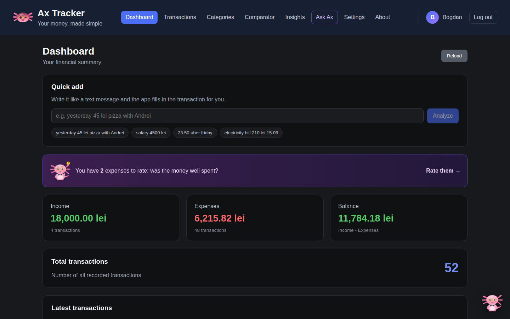
</p>

---

## Highlights

- **Accounts.** Register and log in with ASP.NET Core Identity and JWT. Every user sees only their own data, enforced by global query filters in EF Core.
- **Ax, the financial advisor.** You get a 0–100 financial health score with a full breakdown, strengths, concerns and 3 concrete steps with estimated savings. There is also a chat that answers questions about your own data. Everything is rule-based and computed locally.
- **"Was it worth it?"** Seven days after an expense, you rate it from 1 to 5. A heatmap shows where and when you regret spending.
- **Subscription detective.** It finds recurring payments on its own and flags quiet price increases.
- **Monte Carlo forecast.** It runs 2,000 simulations on your real cash flow and shows a pessimistic, expected and optimistic balance for the next 30–90 days.
- **Quick add in natural language.** For example, `yesterday 45 lei pizza with Andrei` becomes a ready-to-confirm transaction, offline, in Romanian or English.
- **Prices in hours of work.** Set your hourly income and every expense also shows how many hours of your life it cost.
- **Romanian / English.** The whole interface, Ax and quick add switch language instantly from Settings.
- **Profile.** You can change your profile picture, display name and password.
- The basics are covered too: dashboard, transactions with filters and bulk delete, categories, and charts comparing income and expenses.

---

## Screenshots

| | |
|---|---|
| 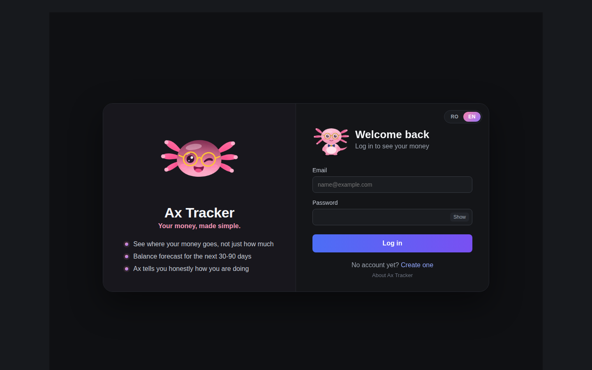 | 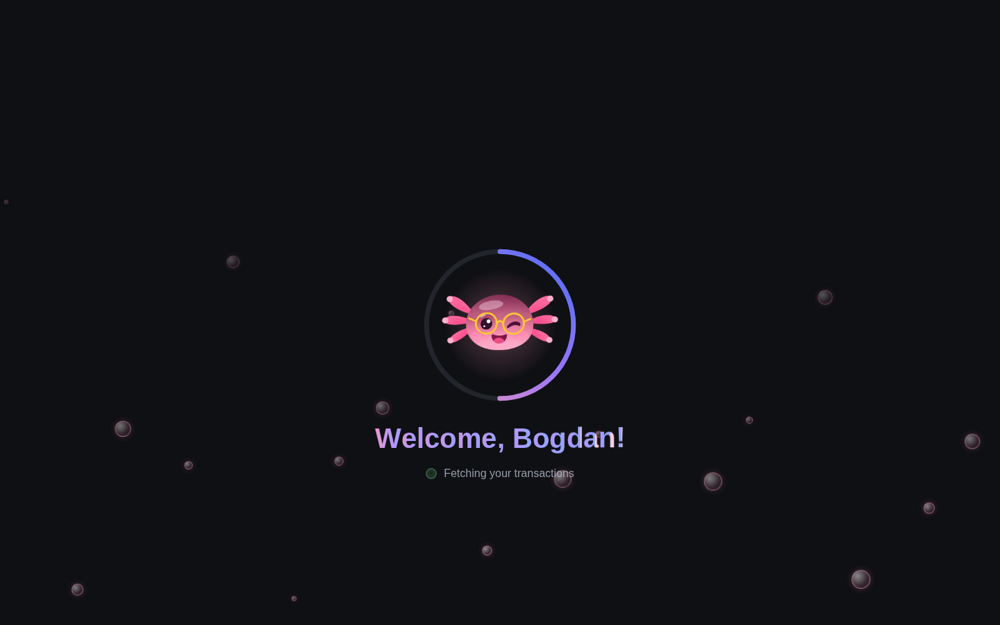 |
| **Login** with an RO / EN switch | **Welcome animation** after logging in |
| 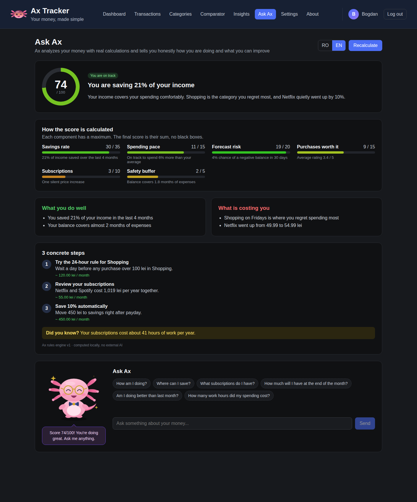 | 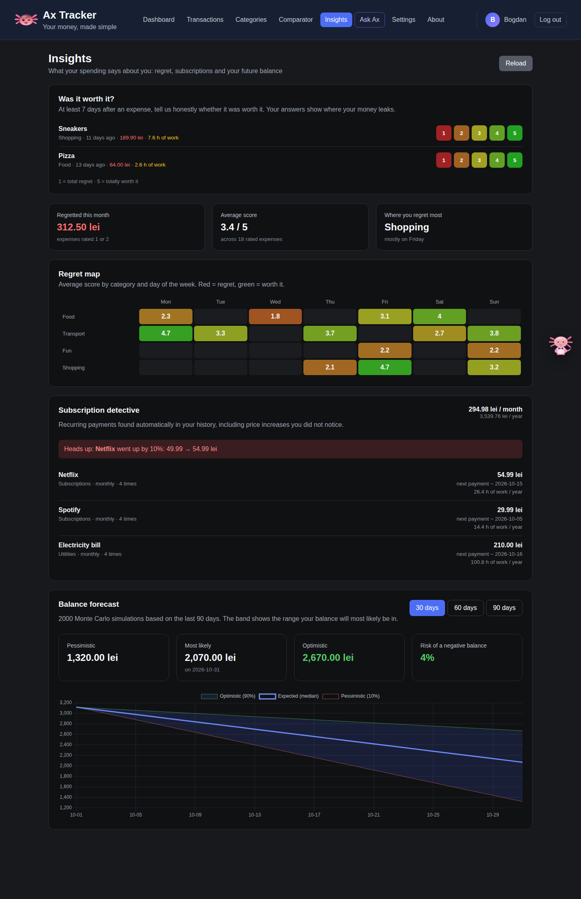 |
| **Ask Ax**: score, breakdown, steps and chat | **Insights**: regret map, subscriptions, forecast |
| 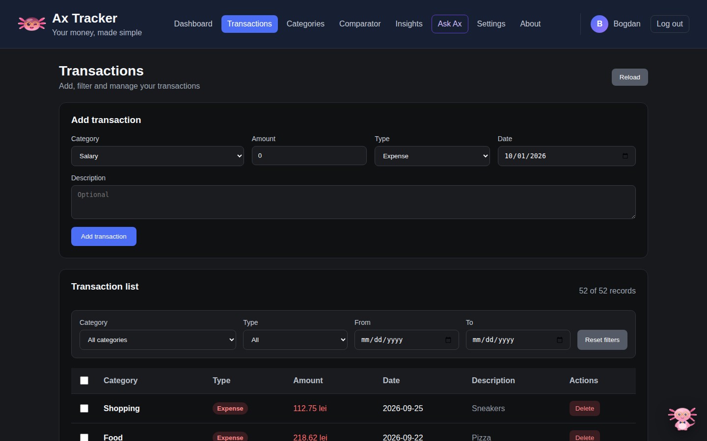 | 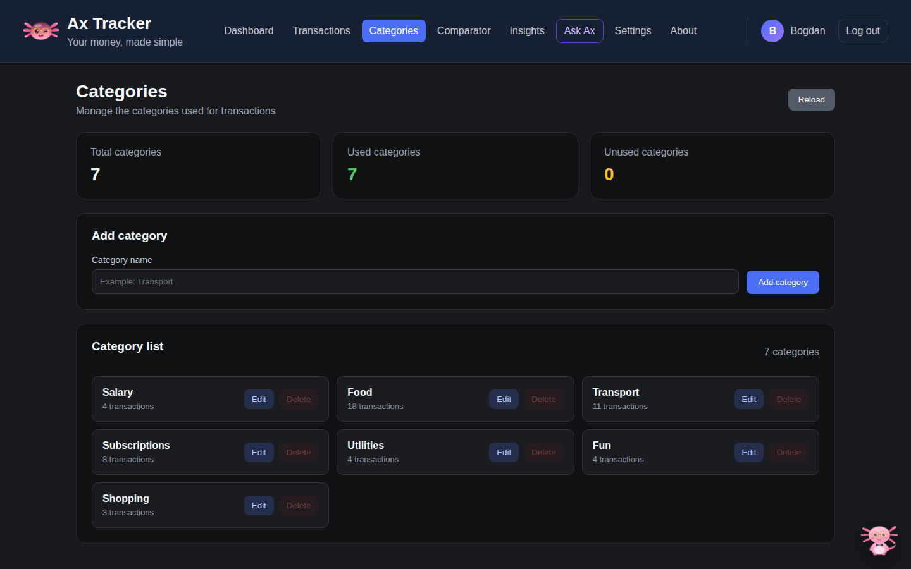 |
| **Transactions** with filters and bulk delete | **Categories** |
| 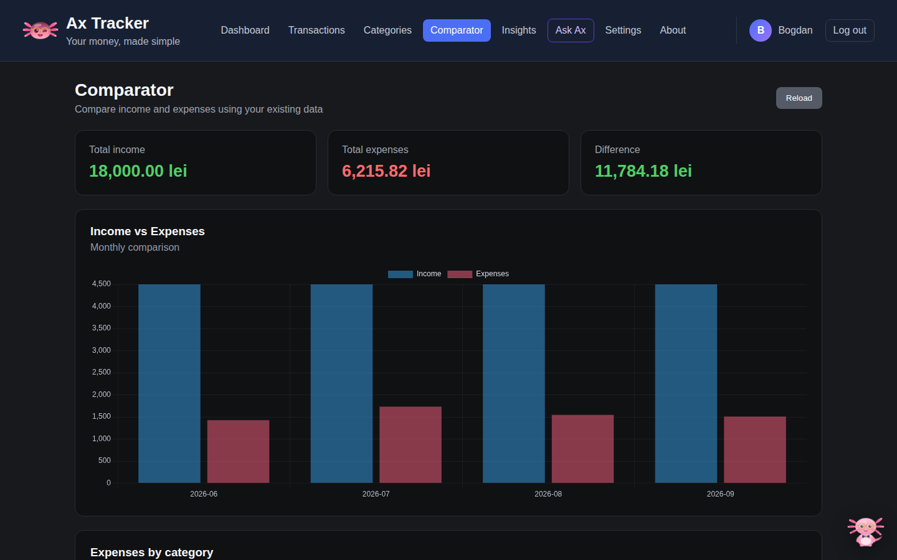 | 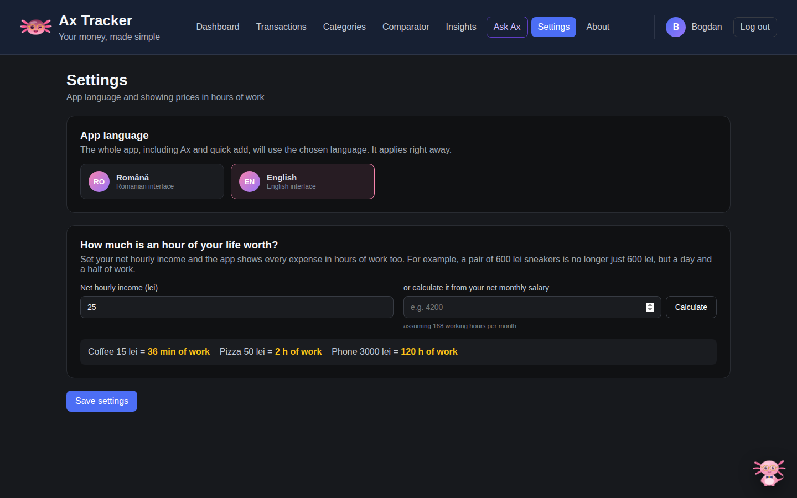 |
| **Comparator** charts | **Settings**: language and hourly income |
| 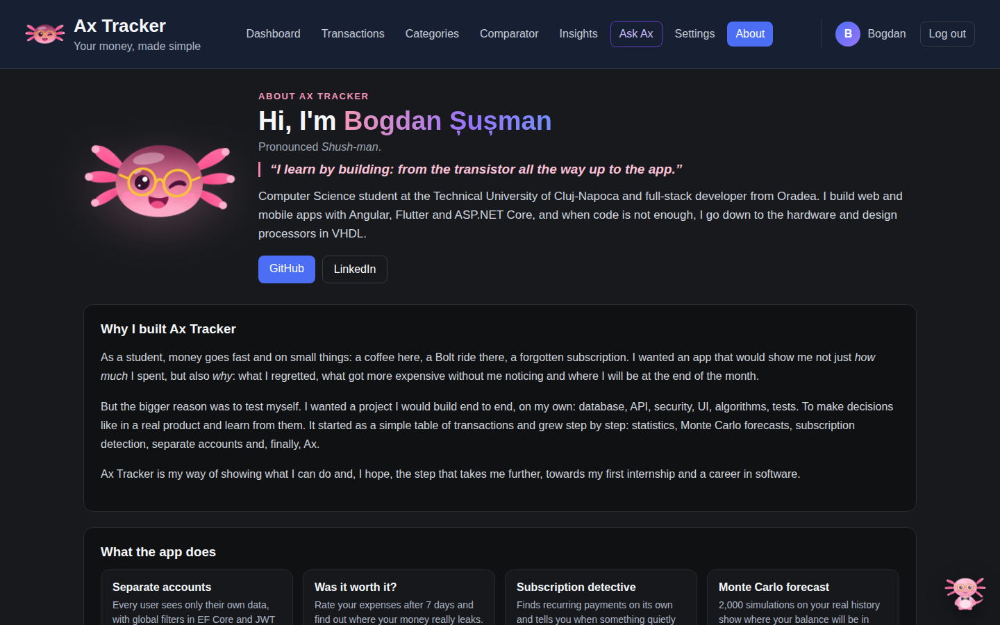 | 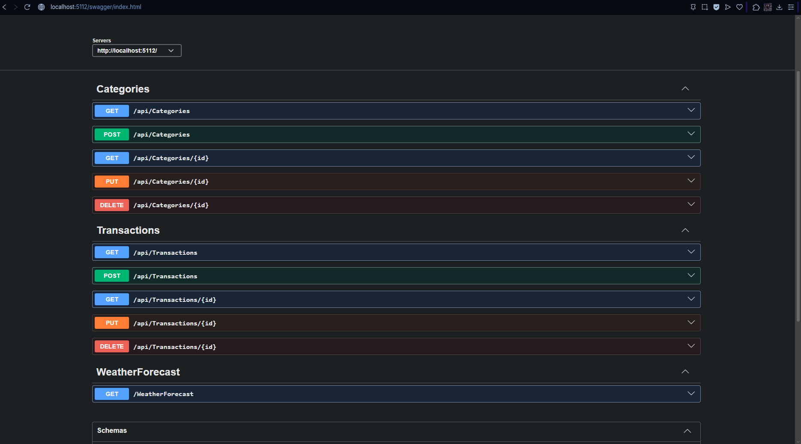 |
| **About** the project and its author | **Swagger UI** for the REST API |

> The screenshots use demo data.

---

## Meet Ax

Ax is an axolotl with round glasses and a bow tie. He is drawn from scratch in SVG and animated only with CSS. He thinks while he calculates, nods when he answers, cheers when you are doing well and gets worried when you risk going into the red. He also follows you on every page with short tips.

His score is the sum of six transparent components:

| Component | Max points |
|---|---|
| Savings rate (last 4 months) | 35 |
| Spending pace compared with your own average | 15 |
| Risk of a negative balance (from the forecast) | 20 |
| Purchases that were worth it | 15 |
| Subscriptions and price increases | 10 |
| Safety buffer | 5 |

More details: [docs/smart-insights.md](docs/smart-insights.md).

---

## Tech stack

**Backend:** C#, ASP.NET Core 10, Entity Framework Core 10, PostgreSQL (Npgsql), ASP.NET Core Identity, JWT bearer authentication, OpenAPI and Swagger UI, xUnit.

**Frontend:** Angular 22 (standalone components, signals, zoneless, new control flow), TypeScript, SCSS, RxJS, Chart.js, and a small custom i18n layer (a `t` pipe with Romanian text as the key).

**Algorithms:** bootstrap Monte Carlo simulation, recurring-payment detection (normalized descriptions plus median interval), a regret heatmap, a keyword- and regex-based natural language parser, and a rule-based scoring model.

---

## Architecture

```text
Angular frontend  ──HTTP + JWT──▶  ASP.NET Core Web API  ──EF Core──▶  PostgreSQL
 (signals, i18n,                    (Identity, controllers,
  Chart.js, Ax SVG)                  Insights / Advisor / QuickAdd services)
```

```text
ExpenseTracker.Api/
├── ExpenseTracker.Api/           ASP.NET Core Web API
│   ├── Controllers/              Auth, Transactions, Categories, Insights, Advisor, QuickAdd, Settings
│   ├── Data/AppDbContext.cs      Identity + per-user global query filters
│   ├── Models/  Dtos/  Migrations/
│   └── Services/
│       ├── Advisor/              RuleBasedAdvisor, AdvisorChatEngine, RO/EN texts
│       ├── Analytics/            BalanceForecaster, SubscriptionDetector, RegretAnalyzer
│       ├── QuickAdd/             NaturalLanguageParser
│       └── Auth/                 JWT token service
├── ExpenseTracker.Tests/         xUnit tests for the analytics, parser and advisor
├── frontend/                     Angular app
│   └── src/app/
│       ├── auth/                 AuthService, interceptor, guards
│       ├── components/           ax-mascot, ax-companion, quick-add, welcome-splash, language-switch
│       ├── i18n/                 I18n service, t pipe, English dictionary
│       ├── pages/                dashboard, transactions, categories, comparator, insights,
│       │                         advisor, settings, profile, about, login, register
│       └── services/  shared/  models/
└── docs/                         feature docs and screenshots
```

---

## API overview

All endpoints except register and login require a `Bearer` token.

| Area | Endpoints |
|---|---|
| Auth | `POST /api/auth/register`, `POST /api/auth/login`, `GET /api/auth/me`, `PUT /api/auth/profile`, `PUT/DELETE /api/auth/avatar`, `POST /api/auth/change-password` |
| Transactions | `GET/POST /api/transactions`, `GET/PUT/DELETE /api/transactions/{id}` |
| Categories | `GET/POST /api/categories`, `GET/PUT/DELETE /api/categories/{id}` (a category that still has transactions cannot be deleted) |
| Insights | `GET /api/insights/regret/pending`, `POST /api/insights/regret/{id}`, `GET /api/insights/regret/summary`, `GET /api/insights/subscriptions`, `GET /api/insights/forecast?days=30` |
| Ax | `GET /api/advisor/report?language=en`, `POST /api/advisor/chat` |
| Quick add | `POST /api/quickadd/parse` |
| Settings | `GET/PUT /api/settings` (hourly rate, language) |

You can explore everything interactively in Swagger UI at `https://localhost:7007/swagger` in Development.

---

## Getting started

### Prerequisites

- .NET 10 SDK, with `dotnet tool install --global dotnet-ef` for migrations
- PostgreSQL
- Node.js and npm

### 1. Clone

```bash
git clone https://github.com/bogdansusman-prog/ExpenseTracker.git
cd ExpenseTracker
```

### 2. Configure secrets (never commit them)

```bash
cd ExpenseTracker.Api

dotnet user-secrets set "ConnectionStrings:DefaultConnection" "Host=localhost;Port=5432;Database=ExpenseTrackerDb;Username=postgres;Password=YOUR_PASSWORD"

# 32+ random characters used to sign the login tokens
dotnet user-secrets set "Jwt:Key" "YOUR_LONG_RANDOM_SECRET"
```

If `Jwt:Key` is missing, Development falls back to a temporary key, so you have to log in again after every restart.

### 3. Create the database and run the API

```bash
dotnet ef database update
dotnet run --launch-profile https
```

### 4. Run the frontend

```bash
cd ../frontend
npm install
npm start
```

Open `http://localhost:4200`, create an account and meet Ax.

### 5. Run the tests

```bash
dotnet test
```

---

## Security

- Passwords are hashed by ASP.NET Core Identity, and sessions use JWTs that expire after 12 hours.
- Every query is filtered by the current user, and new records are assigned to their owner automatically.
- The connection string and JWT key live in .NET User Secrets, not in the repository.
- Profile pictures are validated (type and size) and resized in the browser to 256×256.

---

## Roadmap

- Import bank statements (CSV), starting with BCR
- Monthly budgets and alerts
- CSV and Excel export
- Docker and cloud deployment

---

## Author

Built by **Bogdan Șușman**, a Computer Science student at the Technical University of Cluj-Napoca.

*„I learn by building: from the transistor all the way up to the app.”*

[GitHub](https://github.com/bogdansusman-prog) · [LinkedIn](https://www.linkedin.com/in/bogdan-susman/)

This project was created for learning and portfolio purposes.
